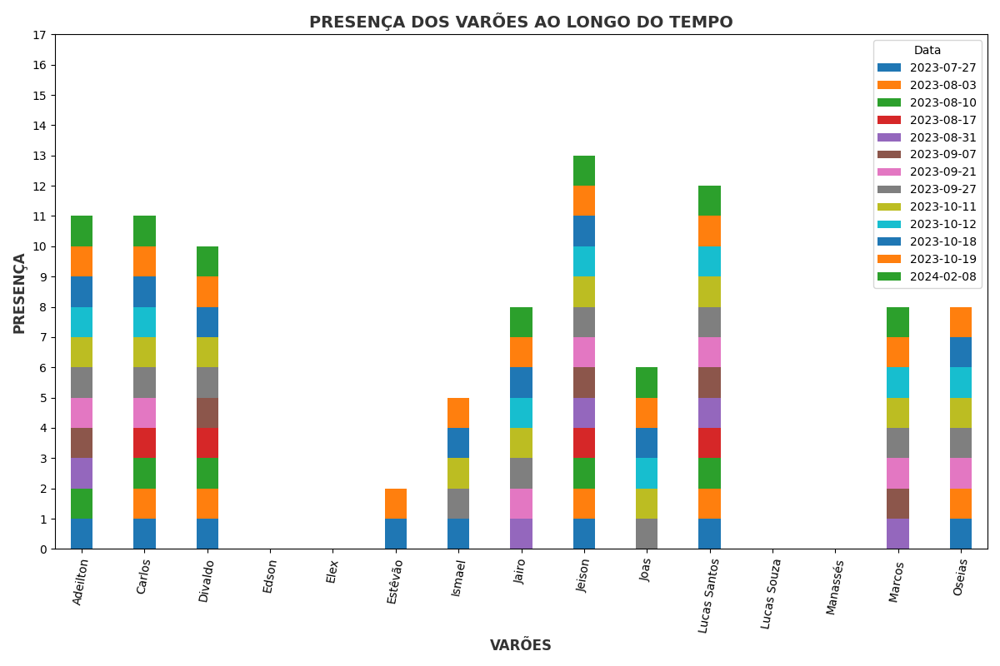

# Relatório De Presença Do Ensaio Dos Varões da ADSeara

## 1. Introdução

- Este relatório tem como objetivo apresentar os resultados obtidos no ensaio dos varões da igreja ADSeara de Ponte dos Carvalhos, Cabo de Santo Agostinho - PE.

## 2. Objetivo

- O objetivo deste relatório é apresentar os resultados sobre a frequência dos varões nos ensaios.

## 3. Como foi feito?

- O relatório foi feito utilizando a linguagem de programação Python, com a biblioteca Pandas para manipulação dos dados e a biblioteca Matplotlib para a geração dos gráficos.

- Os dados foram obtidos através da captura do google sheets, utilizando a biblioteca gspread.

## 4. Como executar?

- Para executar o relatório, é necessário ter o Python instalado na máquina, e as bibliotecas Pandas, Matplotlib e gspread instaladas.

- Para instalar as bibliotecas, basta executar o seguinte comando no terminal:

```bash
pip install -r requirements.txt
```

- Após a instalação das bibliotecas, basta executar o seguinte comando no terminal:

```bash
python report.py
```

## 5. Como foi acessado o google sheets?

- Para acessar o google sheets, foi necessário criar um projeto no google cloud platform, e ativar a API do google sheets.

- Após a ativação da API, foi gerado um arquivo json com as credenciais de acesso, que foi utilizado para acessar o google sheets.

- Para mais informações, acesse o seguinte link: https://gspread.readthedocs.io/en/latest/oauth2.html

- Por enquanto, somente o código esta fazendo a leitura do google sheets, mas em breve, será criado uma interface para facilitar a visualização dos dados.

## 6. Resultado

- imagem do gráfico

